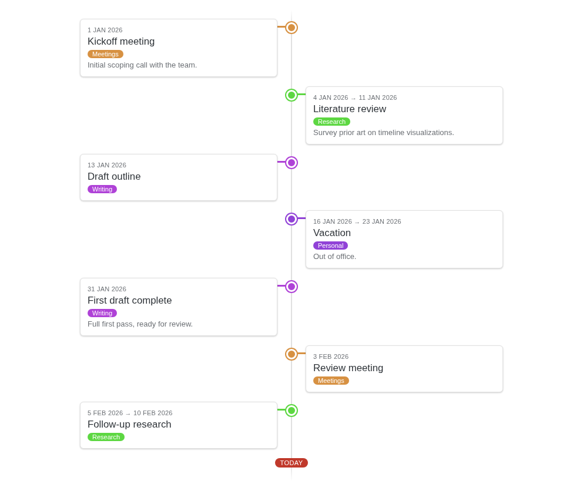
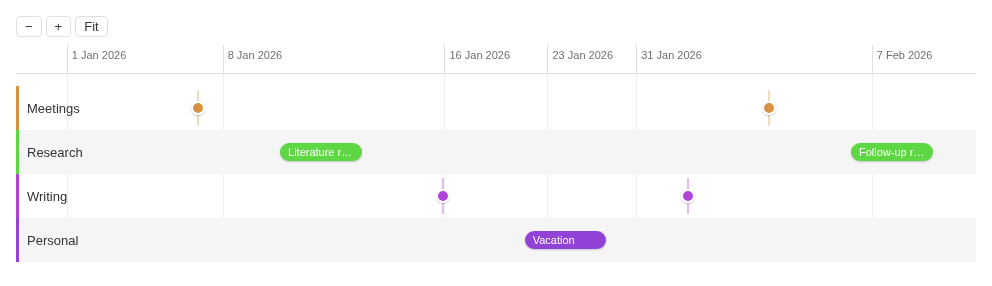
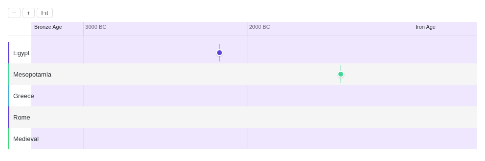

A configurable timeline graph view for [Obsidian](https://obsidian.md). Point it at events in your vault, map a few fields, get an interactive timeline.

Simple by default: name it, pick a source, pick a date field — done. Everything else (field mappings, layout, sort, granularity) already has sensible defaults; toggles just reveal the controls when you want to override one.

## Screenshots

| Vertical | Horizontal | BC/AD & period bands |
| --- | --- | --- |
| [](docs/images/vertical-timeline.png) | [](docs/images/horizontal-timeline.png) | [](docs/images/horizontal-ancient.png) |
| Card list alternating on a spine | Zoomable axis with grouped lanes | For history / ancient-timeline use cases |

## Requirements

- Obsidian ≥ 1.13.0
- [Dataview](https://github.com/blacksmithgu/obsidian-dataview) — only if you use the Dataview source. Table/frontmatter/Tasks sources need nothing extra.

## Two ways to build a timeline

| | **View** | **Code block** |
| --- | --- | --- |
| Where | Settings → Chronograph, opened from the ribbon/command palette | A ` ```chronograph ` block, right in any note |
| Best for | A timeline you come back to | One embedded in the note it's about |
| Sources | Dataview · Table · Frontmatter · Tasks | same four |
| Options | field mappings, layout, sort, granularity | same options, via a settings header |

Pick either — they're equivalent in capability.

### Views

1. Open the timeline pane (ribbon icon, or **Chronograph: Open view**).
2. Settings → Chronograph → **Add view**, then pick a source:

   | Source | What it needs |
   | --- | --- |
   | Dataview query | a DQL string, e.g. `from "Journal" where date` |
   | Markdown table | the vault path of a note with a `\| header \|` + `---` table |
   | Frontmatter | nothing — scans the vault directly; optional tag/folder filter |
   | Obsidian Tasks | checklist lines with an emoji-date (📅 ⏳ 🛫 ✅); optional tag/folder filter |

3. Set the **Date field** (column header or frontmatter key).

That's it — renders as a vertical list, oldest first. It already looks for `title`, `group`, `enddate`, etc. (see [field mappings](#extra-field-mappings)); rename them in settings if your notes differ. Zoom/pan with the toolbar, Ctrl/Cmd+wheel, or plain scroll.

### Code blocks

    ```chronograph
    | date | title | group |
    | --- | --- | --- |
    | 2024-01-01 | Launch | Product |
    | 2024-03-15 | v2 | Product |
    ```

That's the zero-config form — an inline table, columns default to `date`/`title`/`group`. Want a Dataview query, a frontmatter scan, or Tasks instead? Add a `source:` header:

    ```chronograph
    source: dataview
    query: from "Journal" where date
    ```

    ```chronograph
    source: frontmatter
    tag: event
    folder: Journal
    ```

Full key reference: [Advanced: in-note code block settings](#advanced-in-note-code-block-settings).

### Dates

`44 BC` / `44 AD` for a year, or `44-03-15 BC` for day precision — write the calendar year as-is, the suffix handles the BC/AD conversion.

## More features

Each group below already works with the sensible default noted in its heading. The toggle in Settings → Chronograph for that group doesn't turn the feature on or off — it just reveals the controls to override the default per view, off by default so the settings tab only shows what you've chosen to customize.

### Extra field mappings

Every view already looks for the default column/frontmatter keys below, whether or not you've turned this toggle on — turning it on just shows the controls to rename them:

| Field | Default name | Purpose |
| --- | --- | --- |
| End date | `enddate` | Renders the event as a span instead of a point |
| Title | `title` | Falls back to the note's file name if unset |
| Group | `group` | Buckets events into horizontal lanes and derives a color |
| Color | `color` | Explicit CSS color, overrides the group-derived color |
| Kind | `kind` | `event` (default), `period` (background band), or `marker` (flag line) — horizontal layout only |
| Points-to | `pointsto` | Title of another event in the same view to draw a connecting arrow toward — horizontal layout only |

- **Ranged and point events**: an optional end-date field renders events as a span instead of a single marker.
- **Grouping & color**: events auto-color by group, using a curated palette assigned in first-seen order (so the same set of groups always gets the same colors); groups past the 8th distinct one fall back to a deterministic hash. Set an explicit per-event color to override the group color.
- **Connecting arrows**: point one event at another (by title) to draw an arrow between them on the horizontal axis.

### Layout & style (default: vertical list)

- **Two layouts, both zoomable**: a vertical chronological list with cards alternating (or fixed) on either side of a spine, or a horizontal axis with zoom/pan.
- **Horizontal axis**: mouse-wheel/pinch zoom and drag-to-pan, grouped lanes (one row per distinct `group` value), full-height translucent period bands for eras/spans, flag markers for single significant dates, a "today" line, and BC/BCE-aware date formatting.
- **Compressed sparse ranges**: long empty gaps (century+ spans) are compressed on the horizontal axis instead of wasting track width, with a small "⌇" break marker showing where compression happened.
- **Vertical layout options**: which side of the spine cards sit on (alternating, left, or right), and the spine's line style (solid, dashed, dotted).
- **Style overrides** (default: comfortable/medium/subtle): density, card corner radius, marker size, spine thickness, and shadow intensity, each a closed set of presets — see [Custom styling via CSS snippets](#custom-styling-via-css-snippets) for finer-grained control.

### Sort & date granularity (default: oldest first, day precision)

- **Sort order**: oldest or newest first.
- **Date granularity**: from exact day up to millennium, for anything from a daily journal to ancient history. This is usually a per-view choice rather than a vault-wide one — a "life events" view showing decades/centuries and a daily journal view showing exact days can coexist as two separate views, each with its own granularity.

### Multiple views

- Add as many views as you like, each with its own source and settings.
- Once you have more than one, mark one as the **default view** to open it automatically when the timeline pane is created.

### Always available

These aren't behind a toggle — they work regardless of which advanced groups are on:

- **Click-to-create events**: a "+ new event" button in the horizontal toolbar prompts for a date/title and creates the event — a new table row for the table source, or a new note with frontmatter for the Dataview/frontmatter sources.
- **Export snapshot**: an "Export snapshot" button (vertical and horizontal toolbars) saves the current timeline as an SVG image file into your vault. Embed it anywhere with `![[Name snapshot.svg]]` — it renders directly as an image both in Obsidian and on GitHub, no extra software needed.
- **Native hover preview**: hovering an event's title shows Obsidian's built-in note preview popover.
- **Four event sources, for views and code blocks alike**: a Dataview query across the vault, a single-note markdown table, frontmatter scanned directly via Obsidian's own metadata cache, or Obsidian Tasks checklist emoji-dates (the latter two need no Dataview dependency) — plus an "Insert timeline event row" command that scaffolds or appends rows to a table source.
- **Frontmatter/Tasks source filtering**: narrow the frontmatter or Tasks source by tag and/or vault folder, so a single view (or code block) can target e.g. all notes tagged `#event` under `Journal/`.
- **In-note code-block timelines**: see [Code blocks](#code-blocks) above.

## Advanced: in-note code block settings

The ` ```chronograph ` code block accepts the same options as a configured view — same sources, same field mappings, same layout/sort/granularity. Add a settings header above a lone `---` line before the table (the `---` and table are only needed for the table source's inline form; the other sources take no body):

    ```chronograph
    layout: horizontal
    precision: year
    sort: desc
    datefield: when
    ---
    | when | title |
    | --- | --- |
    | 1969 | Moon landing |
    ```

Recognized settings keys:

| Key | Values | Purpose |
| --- | --- | --- |
| `source` | `table` (default) / `dataview` / `frontmatter` / `tasks` | Which of the four event sources this block uses |
| `query` | a DQL string | Dataview source string — used when `source: dataview` |
| `path` | a vault note path | Note whose table to read — used when `source: table`; omit to use the block's own inline table instead |
| `tag` | a tag, with or without `#` | Filter by tag — used when `source: frontmatter` or `source: tasks` |
| `folder` | a vault folder path | Filter by folder — used when `source: frontmatter` or `source: tasks` |
| `layout` | `vertical` / `horizontal` | Same as a view's layout setting |
| `precision` | `day` / `month` / `year` / `decade` / `century` / `millennium` | Date granularity |
| `sort` | `asc` / `desc` | Sort order |
| `cardside` | `alternate` / `left` / `right` | Vertical layout only |
| `linestyle` | `solid` / `dashed` / `dotted` | Vertical layout only |
| `density` | `compact` / `comfortable` (default) / `spacious` | Card padding, node margin, and lane min-height |
| `cardradius` | `none` / `small` / `medium` (default) / `large` | Corner radius for cards, tooltips, and badges |
| `markersize` | `small` / `medium` (default) / `large` | Diameter of the vertical spine dot / horizontal point marker |
| `spinethickness` | `thin` / `medium` (default) / `thick` | Thickness of the vertical spine line / horizontal connector |
| `shadowintensity` | `none` / `subtle` (default) / `normal` | Elevation of card/tooltip shadows |
| `height` | `fill` or a pixel number (default: `fill` for vertical, `480` for horizontal) | Block height before it scrolls internally; `fill` grows with content instead |
| `<field>field` | a column header or frontmatter field name | Field mapping override, one per field in the [extra field mappings](#extra-field-mappings) table (e.g. `titlefield`, `groupfield`), plus `descriptionfield` for the description shown in tooltips and vertical-layout cards |

Unrecognized keys/values are ignored.

## Custom styling via CSS snippets

Beyond the settings above, Chronograph's CSS is a stable, documented surface you can
override with Obsidian's built-in CSS snippets (Settings → Appearance → CSS snippets)
rather than editing the plugin's own files, which get overwritten on update.

Every `.timeline-graph-*` class name in `styles.css` is considered part of that stable
surface. A few CSS custom properties are also set at render time and are usually the
easiest hook for a quick tweak:

| Custom property | Set on | Controls |
| --- | --- | --- |
| `--marker-color` | Each event's dot/connector/card/marker/band | That event's color (group- or explicitly-derived) |
| `--timeline-card-radius` | The timeline's root container | Corner rounding for cards, tooltips, and badges |
| `--timeline-density-gap` | The timeline's root container | Card padding, node spacing, and lane height |
| `--timeline-marker-size` | The timeline's root container | Diameter of the vertical spine dot and horizontal point marker |
| `--timeline-spine-thickness` | The timeline's root container | Width of the vertical spine line and horizontal connector |
| `--timeline-card-shadow` / `--timeline-card-shadow-hover` | The timeline's root container | Card/tooltip elevation shadow, at rest and on hover |

The five `--timeline-*` properties are also settable per view via the **Style overrides** toggle in settings, as closed presets (compact/comfortable/spacious, none/small/medium/large, etc.) — reach for a CSS snippet instead when you want a value outside those presets.

Example snippet — make cards perfectly square-cornered vault-wide:

```css
.timeline-graph-card {
	border-radius: 0;
}
```

## Contributing

Want to build Chronograph from source, run it in dev mode, or find your way around the codebase? See [CONTRIBUTING.md](CONTRIBUTING.md).

## License

MIT
